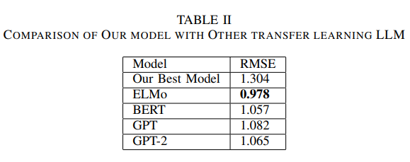
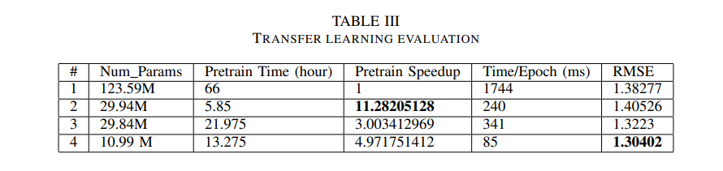
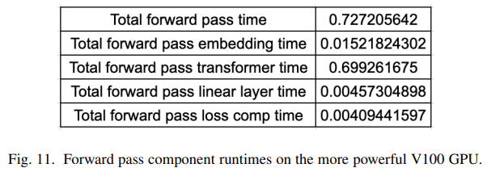

# Optimized Transfer Learning on GPT for Automatic Short Answer Grading

This repository is based on the original NanoGPT repository: https://github.com/karpathy/nanoGPT, from which it is forked.


## Project Description
In this work we extend the open source NanoGPT repository to perform transfer learning on a pretrained GPT model to complete the Automatic Short Answer Grading task. By reducing the pretrained model to a simpler architecture with fewer parameters, optimizing the data loading portion of the training loop, timing and profiling the code, and switching to more powerful hardware, we are able to reduce runtime on the ASAG task without harming signifanctly harming performance. Our final results fall short of state of the art, however our framework can now be used to easily experiment with new architectures and settings to try to improve ASAG performance.

## Code Outline
### Transfer Learning Functionality
The existing train.py file is reused for the transfer learning implementation. A new option in 'init_from', 'transfer', will initialize transfer learning mode. When this mode is active, a new data preprocessing loop is performed, and a new get_batch method is ultimately performed. This will also lead to a new model type being used, the TransferGPT class, which is defined in the model.py file, below the GPT class, which was already in the original implementation. This new class defines the network architecture and the forward pass method, as well as some helper methods, for the TransferGPT model type.

To perform hyperparameter tuning, a hyperparam_sweep.py file is included, this file is completely new. It needs a lot of the same data preprocessing functionality, so this functionality is split out (and for now, unfortunately, duplicated) in the mohler_dataset_preprocessing.py file.

To evaluate transfer learning the eval_transfer.py script was created, which performs the evaluation on the test set.

A jupyter notebook called mohler_transfer_learning_experiments.ipynb contains some experiments which were run to understand the dataset and figure out how to transform it before passing it into the network.

## Sample Commands
To perform the transfer learning related operations, please ensure you are in an environment with everything in the Requirements.txt file installed. Also note that in order to actually perform one of these transfer learning operations, an appropriate checkpoint file from a pretraining job must exist in the pretrained/ directory. If you would like to recreate experiments detailed below and in our paper, please reach out to one of the authors of this repo, who can provide you with a checkpoint, or explain how to create a new one.

With everything in place, different functionalities can be exercised as explained below:

Preparing OpenWebText dataset 

```
python data/openwebtext/prepare.py
```

Pretraining:

```
python train.py config/train_12_768_1024.py
```

Transfer Learning Training:

```
python train.py config/transfer_train.py
```

Evaluation:

```
python eval_transfer.py
```

Hyperparameter Sweep:

```
python hyperparam_sweep.py
```

## Results





